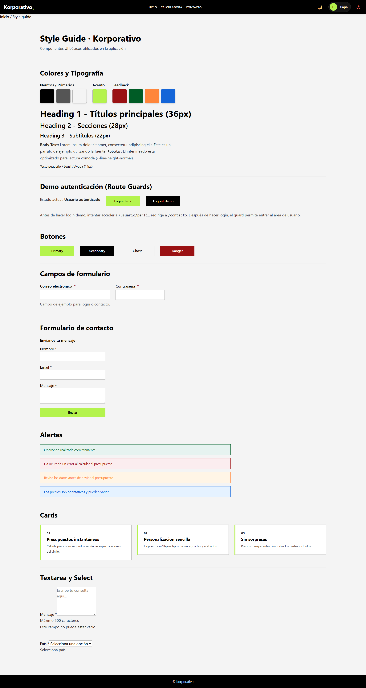
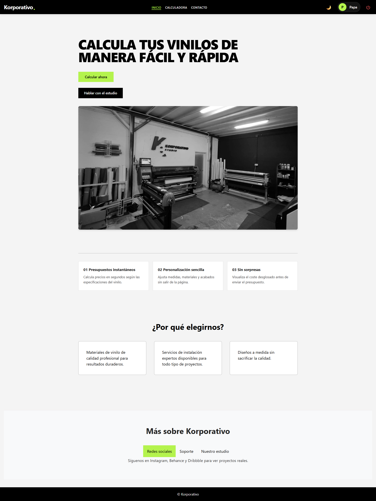
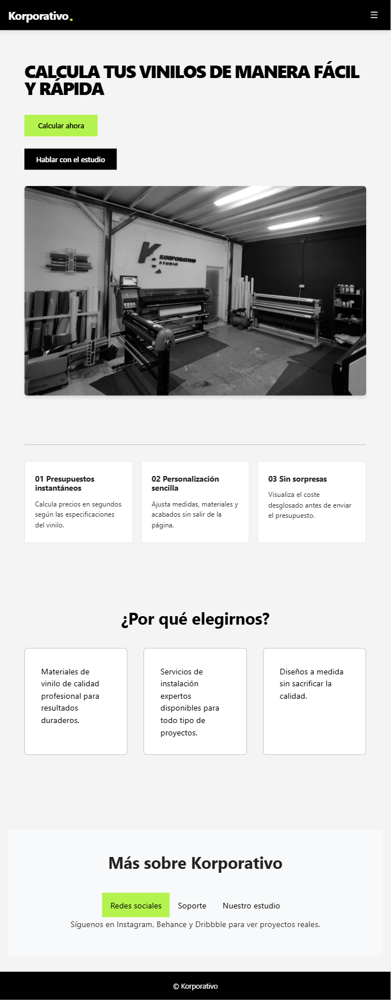
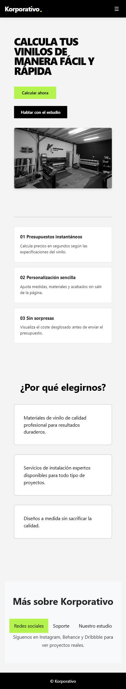
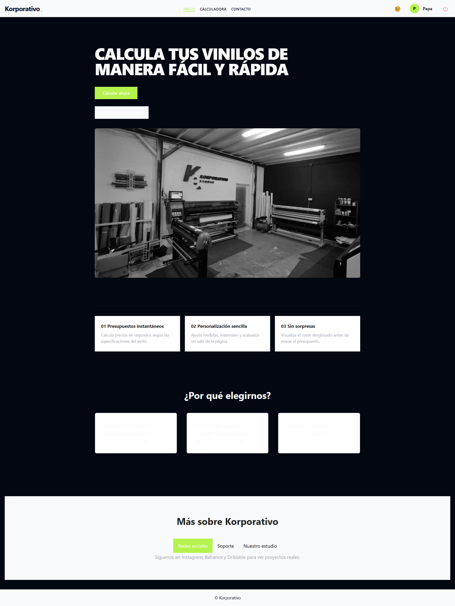

# Memoria Técnica - Diseño de Interfaces Web (DIW)

Este documento detalla el proceso de diseño, implementación y optimización de la interfaz web del proyecto **Korporativo Vinilos**, siguiendo estándares profesionales de arquitectura CSS, accesibilidad y rendimiento.

***

## 1. Arquitectura CSS y comunicación visual

### 1.1 Principios de comunicación visual

En la pantalla inicial de Korporativo se aplican cinco principios básicos de comunicación visual para guiar la atención del usuario:

*   **Jerarquía:** Se construye mediante distintos tamaños y pesos tipográficos. El logotipo "Korporativo" y el título de la Hero Section ("Calcula tus vinilos...") actúan como puntos focales primarios, guiando la vista hacia el botón de acción principal.
*   **Contraste:** Uso de un fondo oscuro (o claro según el tema) en contraste con el color de acento **Verde Lima** (`#a3ff00`) para los elementos interactivos clave (botones, enlaces activos).
*   **Alineación:** Todo el contenido está contenido en un wrapper central (`max-width: 1200px`) y alineado mediante Flexbox y Grid, creando un eje visual vertical sólido.
*   **Proximidad:** Los elementos relacionados (Título + Subtítulo + Botón) se agrupan con márgenes reducidos, separándolos visualmente de otras secciones como el Footer o la Navegación.
*   **Repetición:** Se mantiene una consistencia visual reutilizando los mismos tokens de radio de borde (`border-radius`), sombras y paleta de colores en todos los componentes.

### 1.2 Metodología CSS (BEM + ITCSS)

Se ha utilizado una arquitectura CSS escalable basada en el patrón **ITCSS** (Inverted Triangle CSS) y la metodología de nomenclatura **BEM** (Block, Element, Modifier).

#### Estructura de archivos (ITCSS)
La hoja de estilos principal `styles.scss` importa los parciales en orden de especificidad:

1.  `00-settings/`: Variables globales y tokens (`_colors.scss`, `_typography.scss`).
2.  `01-tools/`: Mixins y funciones (`_mixins.scss`).
3.  `02-generic/`: Normalización y reset (`_reset.scss`).
4.  `03-elements/`: Estilos base de etiquetas HTML (`h1`, `a`, `p`).
5.  `04-layout/`: Estructura mayor (`.layout-header`, `.layout-main`).
6.  `05-components/`: Bloques BEM específicos (`.btn`, `.card`, `.user-capsule`).

#### Nomenclatura BEM
Ejemplo aplicado en el componente `Header`:

```scss
.layout-header {}             /* Bloque */
.layout-header__nav {}        /* Elemento */
.layout-header__logo {}       /* Elemento */
.layout-header__nav--mobile {} /* Modificador */
```

### 1.3 Sistema de Design Tokens
Los valores de diseño no están "quemados" (hardcoded), sino centralizados en variables SCSS y Custom Properties:

*   **Espaciado:** Escala `--spacing-1` a `--spacing-8` (base 4px).
*   **Colores:** Semánticos (`--color-success`, `--color-danger`) y de marca (`--color-accent-important`).
*   **Breakpoints:** Variables SASS `$mobile`, `$tablet`, `$desktop`.

***

## 2. HTML Semántico y estructura

Se ha priorizado el uso de etiquetas semánticas de HTML5 para garantizar la accesibilidad y el SEO.

*   **Landmarks:** `<header>`, `<main>`, `<footer>` y `<nav>` definen las regiones principales.
*   **Contenido:** Uso de `<section>` con encabezados (`h2`) para dividir bloques temáticos.
*   **Interacción:** Uso correcto de `<button>` para acciones (login, toggle theme) y `<a>` para navegación (rutas).
*   **Listas:** Uso de `<ul>` y `<li>` para menús de navegación y listados de características.
*   **Multimedia:** Uso de `<picture>` para dirección de arte en imágenes responsive.

**Validación:** El código HTML ha sido validado sin errores graves en el W3C Validator.

***

## 3. Sistema de componentes UI

El diseño se ha atomizado en componentes reutilizables de Angular, cada uno con su propia hoja de estilos encapsulada.

### Componentes principales
1.  **Header (`app-header`):** Barra de navegación responsive con control de tema y estado de usuario.
2.  **Botones (`.btn`):**
    *   Variantes: `btn--primary` (Verde), `btn--secondary` (Borde), `btn--text` (Ghost).
    *   Estados: Hover, Active, Disabled.
3.  **Tarjetas (`.card`):** Contenedor flexible para mostrar información (ej. Dashboard de presupuestos).
4.  **Inputs (`.form-group`):** Campos de formulario con etiquetas accesibles y validación visual.

### Style Guide
Se ha implementado una página de guía de estilos en `/style-guide` que documenta todos los componentes visuales disponibles.



***

## 4. Estrategia Responsive (Mobile First)

### 4.1 Estrategia
Se ha adoptado una estrategia **Mobile First**. Los estilos base definen la vista para pantallas pequeñas (móviles), y mediante *Media Queries* (`min-width`) se añaden capas de complejidad para Tablet y Desktop.

**Justificación:** Esto optimiza el rendimiento en dispositivos móviles (menos código CSS que procesar) y simplifica la estructura del layout base.

### 4.2 Breakpoints
*   `$mobile`: < 768px (Layout de una columna, menú hamburguesa).
*   `$tablet`: >= 768px (Layout fluido, grid de 2 columnas).
*   `$desktop`: >= 1024px (Layout ancho fijo, menú expandido).

### 4.3 Container Queries
Se han implementado **Container Queries** en las tarjetas de presupuesto para que se adapten según el ancho de su contenedor padre, no del viewport.

```scss
.presupuesto-card-container {
  container-type: inline-size;
}

@container (min-width: 400px) {
  .presupuesto-card {
    flex-direction: row; /* Pasa de vertical a horizontal si hay espacio */
  }
}
```

### 4.4 Tabla de adaptaciones

| Componente | Mobile (<768px) | Tablet (768px - 1024px) | Desktop (>1024px) |
| :--- | :--- | :--- | :--- |
| **Header** | Menú Hamburguesa + Drawer | Menú visible | Menú visible centrado |
| **Hero** | Texto sobre Imagen | Texto e Imagen apilados | Texto e Imagen lado a lado (Grid) |
| **Grid** | 1 Columna | 2 Columnas | 3-4 Columnas |





***

## 5. Optimización Multimedia

### 5.1 Formatos y Estrategia
Se han sustituido formatos legacy (JPG/PNG) por formatos de nueva generación para mejorar el LCP (Largest Contentful Paint).

*   **WebP:** Formato principal para fotografías (balance calidad/peso).
*   **SVG:** Para logotipos e iconos (vectorial, peso mínimo).
*   **Picture:** Uso de `<picture>` para servir diferentes recortes de imagen según el dispositivo.

### 5.2 Tabla de Optimización (Ejemplos reales)

| Imagen | Formato Original | Peso Original | Formato Optimizado | Peso Final | Reducción |
| :--- | :--- | :--- | :--- | :--- | :--- |
| Hero Banner | JPG | 850 KB | WebP | 125 KB | **~85%** |
| User Placeholder | PNG | 45 KB | WebP | 8 KB | **~82%** |
| Logo | PNG | 15 KB | SVG | 2 KB | **~86%** |

### 5.3 Técnicas implementadas
*   **Lazy Loading:** `loading="lazy"` en todas las imágenes *below-the-fold*.
*   **Explicit Size:** Atributos `width` y `height` para evitar *Cumulative Layout Shift* (CLS).
*   **Optimización SVG:** Procesados con SVGO para eliminar metadatos innecesarios.

***

## 6. Sistema de Temas (Dark Mode)

### 6.1 Implementación
El sistema de temas utiliza **CSS Custom Properties** (Variables CSS) definidas en `:root`. El cambio de tema no requiere recargar la página, solo cambia el valor de las variables.

```scss
:root {
    --color-bg: #ffffff;
    --color-text: #1a1a1a;
}
[data-theme="dark"] {
    --color-bg: #121212;
    --color-text: #e0e0e0;
}
```

### 6.2 Funcionalidades
1.  **Toggle Manual:** Botón Sol/Luna en el header.
2.  **Detección Automática:** Lee `prefers-color-scheme` del sistema operativo al iniciar.
3.  **Persistencia:** Guarda la preferencia del usuario en `localStorage` para futuras visitas.
4.  **Transiciones:** `transition: background-color 0.3s ease` para suavizar el cambio.




***

## 7. Aplicación completa y Despliegue

### 7.1 Estado final
La aplicación integra las capas de **DIW** (Diseño), **DWEC** (Lógica Frontend) y **DWES** (Backend Spring Boot).

*   **URL Producción:** `https://korporativo.vercel.app`
*   **Repositorio:** GitHub

### 7.2 Testing Multi-dispositivo y Navegador

Se han realizado pruebas manuales y automatizadas (Lighthouse) para verificar la compatibilidad.

| Dispositivo / Navegador | Resultado Visual | Funcionalidad |
| :--- | :--- | :--- |
| **Chrome (Desktop)** | ✅ Correcto | ✅ Correcto |
| **Firefox (Desktop)** | ✅ Correcto | ✅ Correcto |
| **Safari (iOS Mobile)** | ✅ Correcto | ✅ Correcto |
| **Chrome (Android)** | ✅ Correcto | ✅ Correcto |
