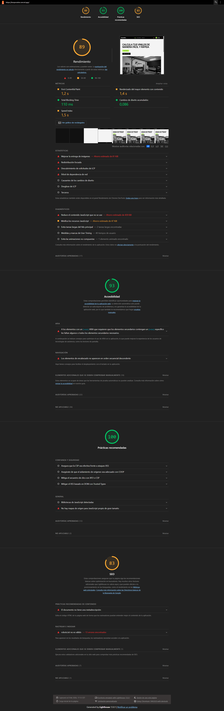

# Fase 1 · Arquitectura de eventos y componentes interactivos

## 1. Introducción

Esta fase cubre la capa de interacción de la aplicación: gestión de eventos del DOM, manipulación directa de elementos mediante ViewChild y ElementRef, y componentes interactivos como el menú hamburguesa, el modal de confirmación y las tabs informativas. También incluye el sistema de temas (theme switcher) con persistencia en localStorage.

---

## 2. Arquitectura general de eventos

### 2.1. Tipos de eventos usados

- **Eventos de ratón**
  - `click`: botones (menú, cerrar modal, enviar formulario, tabs, theme toggle).
  - `document:click`: cierre del menú mobile al hacer clic fuera.

- **Eventos de formularios**
  - `ngSubmit`: envío del formulario de contacto.
  - `Output` personalizado: emisión de `formSubmitted` desde el componente `ContactForm` al componente `Contact`.

- **Eventos de teclado (parcial)**
  - Preparado para usar `keydown`/`keyup` (por ahora no se usa `ESC`, pero la arquitectura lo permite).

### 2.2. Flujo de eventos principales

#### 2.2.1. Menú hamburguesa

1. El usuario pulsa el botón hamburguesa.
2. `Header`:
   - Hace `event.stopPropagation()` para que el `document:click` no cierre inmediatamente el menú.
   - Alterna `isMobileMenuOpen` entre `true/false`.
   - Llama a `updateMobileMenuDOM()`.
3. `updateMobileMenuDOM()` añade o quita la clase `layout-header__nav-mobile--open` en el elemento referenciado con `@ViewChild('mobileMenu')` (usa `ElementRef` para manipular clases del DOM).
4. Un `@HostListener('document:click')` escucha clics globales:
   - Si `isMobileMenuOpen` es `true` y el clic no viene del botón, se pone a `false` y se actualiza el DOM de nuevo.
5. El resultado es un menú mobile que se abre/cierra con animación y se cierra al hacer clic en cerrar.

#### 2.2.2. Theme switcher

1. El botón de tema en el header llama a `onToggleTheme()`.
2. `Header` delega en `ThemeService.toggleTheme()`.
3. `ThemeService`:
   - Obtiene el tema actual (`light`, `dark`, `system`) desde un `BehaviorSubject`.
   - Calcula el siguiente (`dark` ↔ `light`).
   - Llama a `setTheme(next)`:
     - Guarda el valor en `localStorage` (solo en navegador).
     - Actualiza el `BehaviorSubject` (`theme$`) para que cualquier componente suscrito se actualice.
     - Añade o quita la clase `dark-theme` en `<html>` (`document.documentElement`).
4. El header está suscrito a `theme$` para mostrar el texto correcto del botón (`Tema oscuro` / `Tema claro`).

#### 2.2.3. Formulario de contacto y modal

1. El usuario pulsa **Enviar** en `ContactForm`:
   - El botón dispara `(click)="onSubmit()"` o el formulario dispara `(ngSubmit)="onSubmit()"`.
2. `ContactForm`:
   - Recoge/valida los datos (validación por ahora básica).
   - Emite el evento de salida `formSubmitted.emit()` (decorador `@Output()`).
3. El componente `Contact` escucha ese evento:

```
<app-contact-form (formSubmitted)="onFormSubmit()"></app-contact-form>
```

4. `Contact.onFormSubmit()`:
- Muestra un log en consola.
- Llama a `this.modal.openModal()` usando `@ViewChild('modal') modal!: ModalComponent;`.
5. `ModalComponent` controla la visibilidad con un booleano o `*ngIf`:
- Muestra el toast con el mensaje de éxito (mensaje enviado correctamente).
- El botón **Cerrar** llama a `closeModal()` para ocultarlo.

Este flujo demuestra comunicación hijo → padre (Output) y padre → hijo (ViewChild).

#### 2.2.4. Tabs en la página de inicio

1. `Home` pasa un array de pestañas a `TabsComponent` mediante `@Input()`:

```
demoTabs = [
{ id: 'redes', label: 'Redes sociales', content: '…' },
{ id: 'soporte', label: 'Soporte', content: '…' },
{ id: 'equipo', label: 'Nuestro estudio', content: '…' },
];
```
```
<app-tabs [tabs]="demoTabs"></app-tabs>
```

2. `TabsComponent` mantiene el estado `activeTab` (ej. `'redes'`).
3. Cada botón de pestaña tiene `(click)="activeTab = tab.id"`.
4. En la vista, solo el panel cuya `tab.id` coincide con `activeTab` muestra su contenido (vía binding de clases y `*ngIf`).
5. Resultado: el contenido cambia sin recargar ni navegar de ruta.

---

## 3. Componentes interactivos implementados

### 3.1. Menú hamburguesa (header)

- **Ubicación**: `components/layout/header/`.
- **Funcionalidad**:
- Abre/cierra el menú mobile con botón hamburguesa.
- Cierra al hacer clic fuera (document click).
- Usa `ViewChild + ElementRef` para añadir/quitar clases CSS.
- Usa `stopPropagation` para evitar cierres no deseados.

### 3.2. Modal de contacto / toast de confirmación

- **Ubicación**: `modal/` + uso en `pages/contact/`.
- **Funcionalidad**:
- Se abre al enviar correctamente el formulario de contacto.
- Muestra un mensaje de confirmación.
- Se cierra con botón “Cerrar”.
- Usa `@ViewChild` para que el padre controle la apertura.

### 3.3. Tabs informativos en Home

- **Ubicación**: `components/shared/tabs/`.
- **Funcionalidad**:
- Muestra varias pestañas (Redes sociales, Soporte, Nuestro estudio).
- Cambia el contenido al hacer clic en cada pestaña.
- Usa `@Input()` para recibir configuración y estado interno `activeTab`.

### 3.4. Theme Switcher

- **Ubicación**: `services/theme.service.ts` + botón en `header`.
- **Funcionalidad**:
- Alterna entre tema claro/oscuro.
- Persistencia en `localStorage`.
- Aplica el tema en el arranque.
- Expone un observable `theme$` para que otros componentes reaccionen.

---

## 4. Manipulación del DOM

### 4.1. Acceso al DOM

- `Header` usa `@ViewChild('mobileMenu') mobileMenu?: ElementRef<HTMLElement>;` para:
- Añadir/quitar la clase `layout-header__nav-mobile--open`.

### 4.2. Control de visibilidad estructural

- `ModalComponent` y otros usan `*ngIf` para crear/destruir nodos del DOM según su estado (`isModalOpen`, etc.).
- Los tabs crean múltiples paneles y muestran solo el activo, controlando la estructura DOM sin manipular `innerHTML` directamente.

---

## 5. Tabla de eventos y compatibilidad

| **Evento**                 | **Dónde se usa**                              | **Propósito**                                    | **Compatibilidad**                          |
|---------------------------|-----------------------------------------------|--------------------------------------------------|---------------------------------------------|
| `click`                   | Botones de menú, tabs, enviar, cerrar modal   | Interacciones principales de usuario             | Excelente en todos los navegadores modernos |
| `document:click`          | Header (HostListener)                         | Cerrar menú mobile al hacer clic fuera          | Excelente en todos los navegadores modernos |
| `ngSubmit`                | Formulario de contacto                        | Manejar envío de formulario en Angular          | Excelente (Angular abstrae el evento)       |
| `Output` (`EventEmitter`) | ContactForm → Contact                         | Comunicación hijo → padre                        | Soportado por todas las versiones de Angular|
| `localStorage`            | ThemeService                                  | Persistir preferencia de tema                    | Navegadores modernos en entorno browser     |

*(Compatibilidad entendida como soporte en los navegadores evergreen actuales: Chrome, Edge, Firefox, Safari.)*

---

## 6. Resumen de cumplimiento Fase 1

- **Manipulación del DOM en componentes**  
- Acceso con `ViewChild` + `ElementRef`.  
- Modificación dinámica de clases y estilos (menú mobile, modal).  
- Creación/eliminación estructural con `*ngIf` y *ngFor.

- **Sistema de eventos**  
- Event binding (`click`, `ngSubmit`, outputs).  
- Prevención de comportamientos por defecto (`preventDefault` en formularios).  
- Control de propagación (`stopPropagation` en el botón hamburguesa).  

- **Componentes interactivos funcionales**  
- Menú hamburguesa con apertura/cierre y cierre al click fuera.  
- Modal/Toast de contacto con abrir/cerrar.  
- Tabs informativos en Home.

- **Theme Switcher funcional**  
- Detecta y aplica tema guardado en `localStorage`.  
- Permite alternar claro/oscuro.  
- Aplica el tema al cargar la aplicación.

# Fase 2 · Servicios y comunicación entre componentes

## 1. Introducción

En este punto del proyecto desarrollamos los servicios reutilizables para comunicación entre componentes. Esto incluye un servicio de notificaciones (toasts) que se muestra en cualquier parte de la app y un servicio de loading para controlar el spinner global durante operaciones asíncronas.

---

## 2. Arquitectura general de servicios

### 2.1. Tipos de servicios usados

- **LoadingService**: Gestión global de estados de carga
  - `BehaviorSubject<boolean>` para estado reactivo
  - Métodos `show()/hide()` públicos

- **NotificationsService**: Sistema de toasts/notificaciones
  - `Subject<Notification[]>` para array de mensajes
  - Tipos: `success`, `error`, `info`, `warning`

- **Patrón Observable/Subject**: Comunicación reactiva entre componentes

### 2.2. Flujo de eventos principales

#### 2.2.1. LoadingService (Spinner global)

1. El usuario pulsa **Enviar** en formulario de Contacto
2. `ContactComponent`:
   - Llama `this.loadingService.show()`
   - `LoadingService` emite `true` vía `loading$`
3. `AppSpinnerComponent` suscrito muestra overlay:
   - `position: fixed; inset: 0; z-index: 9998`
4. Tras 2s simulación: `loadingService.hide()` → emite `false`

```
Contact → LoadingService.show() → AppSpinner (global)
```
#### 2.2.2. NotificationsService (Toasts)

1. `ContactComponent` llama `notificationsService.success('Enviado')`
2. `NotificationsService` añade toast al array `notifications$`
3. `AppComponent` suscrito renderiza `<app-toast>` por cada notif
4. Auto-dismiss configurable (3-7s por tipo)

```
Contact → NotificationsService → AppComponent → AppToast ×N
```

---

## 3. Servicios implementados

### 3.1. LoadingService
```
src/app/services/loading.ts
```

- **Ubicación**: `services/loading.service.ts`
- **Funcionalidad**: Control global de spinner
- **Consumidor**: `AppSpinnerComponent`

### 3.2. NotificationsService
```
src/app/services/notification.ts
```

- **Ubicación**: `services/notification.ts`
- **Funcionalidad**: Toasts multinotificación
- **Consumidores**: `AppComponent` → `AppToastComponent`

### 3.3. Componentes de presentación
```
src/app/components/shared/spinner/spinner.ts
src/app/components/shared/toast/toast.ts
src/app/app.ts
```

---

## 4. Manipulación de estado reactivo

### 4.1. Suscripciones en componentes

- `AppSpinner`: `loading$ = this.loadingService.loading$`
- `AppComponent`: `notifications = this.notificationsService.notifications$`
- `*ngIf="(loading$ | async)"` y `*ngFor="let notif of notifications"`

### 4.2. Control de visibilidad estructural

- Spinner: `*ngIf` crea/destruye overlay completo
- Toasts: `*ngFor` renderiza dinámicamente cada notificación
- Auto-dismiss: `setTimeout` en servicio quita toast del array

---

## 5. Tabla de servicios y compatibilidad

| **Servicio**            | **Dónde se usa**                  | **Propósito**                       | **Compatibilidad**            |
|-------------------------|-----------------------------------|-------------------------------------|-------------------------------|
| **LoadingService**      | AppSpinner (global)              | Spinner durante operaciones async   | Angular RxJS completo         |
| **NotificationsService**| AppComponent → AppToast          | Sistema toasts multinotificación    | Angular RxJS completo         |
| **Observables**         | Todos los servicios              | Comunicación reactiva               | Angular 16+ RxJS 7+           |

# Fase 3 · Formularios Reactivos Avanzados

## 1. Introducción

Aquí trabajamos con formularios reactivos avanzados en el componente `RegisterForm`. Usamos FormBuilder para construir el formulario, validadores síncronos y asíncronos (email único, username disponible), validación cross-field para comparar contraseñas y un FormArray dinámico que permite añadir múltiples teléfonos.

---

## 2. Arquitectura general de formularios

### 2.1. Tipos de validadores implementados

- **Síncronos integrados**: `required`, `email`, `minLength(8)`
- **Síncronos personalizados**: `passwordFuerteValidator`, `telefonoValidator`
- **Cross-field**: `passwordsIgualesValidator` (form-level)
- **Asíncronos**: `emailUnicoValidator()`, `usernameDisponibleValidator()`

### 2.2. Flujo de validación principal

#### 2.2.1. Formulario reactivo completo
```
register-form.ts → FormBuilder.group() → 6 controles + FormArray
↓
Validación touched/dirty → Errores condicionales → Submit deshabilitado
```

#### 2.2.2. FormArray teléfonos dinámico
1. Usuario pulsa **"+ Añadir teléfono"**
2. `addTelefono()` → `telefonosArray.push(new FormGroup())`
3. `*ngFor` renderiza nuevo `<section>` con validación individual
4. `removeTelefono(i)` → `telefonosArray.removeAt(i)`

---

## 3. Validadores implementados

### 3.1. Tabla de validadores

| **Validador**                  | **Tipo**      | **Descripción**                          | **Ubicación**              |
|--------------------------------|---------------|------------------------------------------|----------------------------|
| `passwordFuerteValidator`      | Síncrono      | ≥8 chars + Mayús/Minús/Números           | `password` control         |
| `passwordsIgualesValidator`    | Cross-field   | Compara `password`/`confirmPassword`     | FormGroup level            |
| `telefonoValidator`            | Síncrono      | 9 dígitos numéricos                      | `phone` + FormArray        |
| `emailUnicoValidator()`        | Asíncrono     | Simula API (800ms delay)                 | `email` control            |
| `usernameDisponibleValidator()`| Asíncrono     | Simula API (600ms delay)                 | `username` control         |

### 3.2. Estados visuales
- **Errors**: `*ngIf="control.touched && hasError('X')"`
- **Pending**: `*ngIf="control.pending"` (loading asíncrono)
- **Submit**: `[disabled]="form.invalid"`

---

## 4. FormArray - Teléfonos múltiples

```
src/app/register-form.ts
```

**Implementación**:

```
telefonos: this.fb.array([
this.fb.group({numero: ['', [Validators.required, this.telefonoValidator]]})
])
```


**Template**:
```
<section formArrayName="telefonos"> <ng-container *ngFor="let tel of telefonosArray.controls; let i=index" [formGroupName]="i"> <!-- Validación individual por teléfono --> </ng-container> </section>
```

## 5. Gestión de estados reactivos

### 5.1. Feedback visual

```
touched → muestra errores específicos
pending → "Comprobando disponibilidad..."
invalid → deshabilita botón submit
```
### 5.2. Comunicación reactiva

- `form.valueChanges` implícito vía `FormBuilder`

- `form.statusChanges` → botón dinámico

- `AsyncValidatorFn` con `delay()` simula APIs reales

# Fase 4 · Sistema de rutas y navegación

## 1. Introducción

El sistema de rutas de la SPA se configura con Angular Router para gestionar toda la navegación. Tenemos rutas principales (inicio, calculadora, contacto), el flujo completo de presupuestos con parámetros dinámicos (`/presupuestos/:id`), un área de usuario protegida con lazy loading y una página 404 para rutas inexistentes.

---

## 2. Mapa de rutas

| Ruta                       | Tipo           | Componente           | Descripción                                                   |
|---------------------------|----------------|----------------------|---------------------------------------------------------------|
| `/`                       | Principal      | `Home`               | Página de inicio de Korporativo Studio.                      |
| `/style-guide`            | Principal      | `StyleGuide`         | Guía de estilos con todos los componentes UI.                |
| `/contacto`               | Principal      | `Contact`            | Información de contacto y formulario accesible.              |
| `/calculadora`            | Principal      | `Calculator`         | Calculadora de precios de vinilos.                           |
| `/presupuestos`           | Listado        | `BudgetsList`        | Listado de presupuestos con enlaces al detalle.              |
| `/presupuestos/:id`       | Detalle        | `BudgetDetail`       | Detalle de un presupuesto concreto a partir de su `id`.      |
| `/usuario`                | Layout padre   | `UserLayout`         | Área de usuario con navegación interna.                      |
| `/usuario/perfil`         | Hija           | `UserProfile`        | Subpágina de perfil dentro de `UserLayout`.                  |
| `/usuario/pedidos`        | Hija           | `UserOrders`         | Subpágina de pedidos dentro de `UserLayout`.                 |
| `**`                      | Wildcard (404) | `NotFound`           | Página 404 para rutas inexistentes (ruta wildcard al final). |

---

## 3. Rutas con parámetros y rutas hijas

- **Presupuestos**  
  - `/presupuestos` muestra un listado de presupuestos cargados desde la API REST (`GET /api/presupuestos`), cada uno con un enlace `routerLink="['/presupuestos', budget.id]"`.  
  - `/presupuestos/:id` lee el parámetro dinámico mediante `ActivatedRoute.paramMap` y carga el detalle del presupuesto usando el servicio HTTP (`GET /api/presupuestos/{id}`), mostrando su información principal en `BudgetDetail`.  
  - Este patrón cubre el caso típico de **listado → detalle**, ahora ya conectado a una API real en lugar de usar datos mock.

- **Zona de usuario con rutas hijas**  
  - La ruta padre `/usuario` usa `UserLayout`, que incluye un menú interno con `routerLink="perfil"` y `routerLink="pedidos"` y un `<router-outlet>` secundario.  
  - Las rutas hijas `/usuario/perfil` y `/usuario/pedidos` se cargan dentro de este layout, manteniendo fijo el título “Área de usuario” y cambiando solo el contenido interno.

---

## 4. Ruta 404 y navegación básica

- La ruta wildcard `**` está al final de la configuración y carga el componente `NotFound`, con mensaje de error y enlace de vuelta a `/`.  
- La navegación principal entre páginas se realiza con `routerLink` en el header y otras secciones (inicio, calculadora, contacto, style guide, presupuestos), evitando enlaces estáticos y recargas completas de página.

---

## 5. Navegación programática y uso de `state`

- Desde el listado de presupuestos se navega al detalle usando código en lugar de solo `routerLink`, con `this.router.navigate(['/presupuestos', budget.id], { state: { budget } })`.​

- Se envía el objeto presupuesto completo en la propiedad `state`, evitando repetir una carga o simular aún una API real.​

- En `BudgetDetail`, el constructor recupera el parámetro `id` desde `ActivatedRoute.paramMap` y el objeto `budget` desde `router.getCurrentNavigation()?.extras.state?.['budget']`.​

- El componente muestra el título y el total del presupuesto, además de un enlace de vuelta al listado, demostrando el patrón completo listado → navegación programática → detalle.

---

## 6. Lazy loading y precarga de módulos

- El área de usuario (`/usuario`) está aislada en un archivo separado `pages/user/user.routes.ts`. Agrupa las rutas `UserLayout`, `UserProfile` y `UserOrders` bajo una misma ruta padre.
- En el router principal (`app.routes.ts`), la ruta `/usuario` usa `loadChildren` para carga perezosa: el código del área de usuario solo se descarga cuando el usuario navega allí.
- La configuración del router incluye `withPreloading(PreloadAllModules)`. Tras la carga inicial, Angular descarga los módulos lazy en segundo plano para que la navegación sea instantánea.
- Al ejecutar el build de producción (`ng build --configuration production`), se generan chunks diferenciados. Además del bundle principal (`main-*.js`), hay un chunk específico `user-routes` que confirma la segmentación del código.

---

## 7. Route Guards: protección de rutas y cambios sin guardar

Aquí implementamos **Route Guards** para controlar tanto el acceso a rutas sensibles como la salida de páginas con formularios sin guardar.

### 7.1. CanActivate: área de usuario protegida

- Se ha creado un servicio de autenticación simulado `AuthService` que mantiene un estado interno de “usuario autenticado” (`loggedIn`) y permite cambiarlo mediante métodos `login()` y `logout()`.  
- En `src/app/guards/auth.guard.ts` se define un guard funcional `authGuard` basado en **CanActivate**, que se ejecuta antes de acceder al área de usuario.  
- El guard inyecta `AuthService` y `Router` y aplica la lógica:  
  - Si `auth.isLoggedIn()` es `true`, devuelve `true` y permite navegar a la ruta solicitada.  
  - Si es `false`, guarda la URL a la que el usuario intentaba acceder mediante `auth.setRedirectUrl(state.url)` y devuelve `router.parseUrl('/contacto')`, redirigiendo a la página de contacto.  
- En la configuración de rutas (`app.routes.ts`), el área `/usuario` queda protegida así:

  ```ts
  {
    path: 'usuario',
    canActivate: [authGuard],
    loadChildren: () =>
      import('./pages/user/user.routes').then(m => m.USER_ROUTES),
  },
  ```

  De esta forma, cualquier intento de entrar en `/usuario/perfil` o `/usuario/pedidos` sin “login” simulado redirige automáticamente a `/contacto`.

- Para **simular la autenticación** de forma visible, en la página de Style Guide se inyecta `AuthService` y se añade una sección de demo con:  
  - Un texto que muestra el estado actual (`Usuario autenticado` / `Invitado`).  
  - Dos botones `Login demo` y `Logout demo` que llaman a `auth.login()` y `auth.logout()`.  
  Esto permite demostrar cómo, tras hacer “Login demo”, el guard deja de bloquear `/usuario/...` y la navegación al área de usuario pasa a ser correcta.

### 7.2. CanDeactivate: formulario de registro con cambios sin guardar

- El componente `RegisterForm` (`components/shared/register-form/register-form.ts`) utiliza formularios reactivos avanzados y se ha ampliado para detectar cambios no guardados:  
  - Se añade `markAsSaved()` que marca el formulario como `pristine` tras un envío correcto.  
  - Se expone el método `hasUnsavedChanges()` que devuelve `true` cuando el formulario está `dirty` y el envío (`submitted`) no se ha completado.  
  - En `onSubmit()`, después de validar y procesar el registro, se llama a `markAsSaved()` para limpiar el estado de cambios pendientes.

- En `src/app/guards/pending-changes.guard.ts` se crea un guard funcional `pendingChangesGuard` basado en **CanDeactivate** y tipado para `RegisterForm`. Su lógica es:  
  - Si `component.hasUnsavedChanges()` es `false`, devuelve `true` y permite salir sin preguntar.  
  - Si hay cambios sin guardar, muestra un diálogo nativo de confirmación:

    ```ts
    return confirm(
      'Hay cambios sin guardar en el formulario de registro. ¿Seguro que quieres salir de la página?'
    );
    ```

    Si el usuario acepta, la navegación continúa; si cancela, permanece en la ruta actual.

- En el sistema de rutas (`app.routes.ts`), se ha definido una ruta específica para este formulario:

  ```ts
  {
    path: 'registro',
    component: RegisterForm,
    canDeactivate: [pendingChangesGuard],
  },
  ```

  De este modo, cualquier intento de salir de `/registro` con el formulario modificado dispara el guard y muestra el aviso de “cambios sin guardar”.

Con este conjunto se cubre el uso combinado de **CanActivate** y **CanDeactivate**: el primero protege el acceso al área de usuario mediante una autenticación simulada con redirección a una ruta pública, y el segundo evita la pérdida accidental de datos en el formulario de registro, pidiendo confirmación al usuario antes de abandonar la página.

---

## 8. Resolvers

En la ruta de detalle de presupuesto se ha usado un **resolver** para cargar los datos desde la API antes de activar el componente y evitar vistas en blanco.

- `BudgetsHttpService` expone métodos `getBudgets()` y `getBudgetById(id)` que llaman a la API REST de Spring Boot (`GET /api/presupuestos` y `GET /api/presupuestos/{id}`), centralizando el acceso HTTP a los presupuestos en el frontend.  
- El resolver funcional `budgetResolver` inyecta este servicio y el router, lee el `id` desde `paramMap`, llama a `getBudgetById(id)` y devuelve el presupuesto o `null` si no existe.  
- En caso de presupuesto inexistente o error, el resolver redirige a `/presupuestos` con `queryParams` (`error=not-found` o `error=server-error`), evitando dejar el detalle en un estado inconsistente.  
- La ruta `/presupuestos/:id` se configura con `component: BudgetDetail` y `resolve: { budget: budgetResolver }`, de modo que el componente puede recibir el dato ya resuelto en `route.data['budget']`, aunque internamente también dispone del servicio HTTP para refrescar o editar el presupuesto.  
- `BudgetsList` sigue leyendo `queryParams.error` y muestra un aviso contextual (“Ha ocurrido un error al cargar el presupuesto.”) cuando el usuario es redirigido desde el resolver.

---

## 9. Breadcrumbs dinámicos

En esta parte se ha implementado un sistema de **breadcrumbs dinámicos** construido a partir de la configuración de rutas, que se actualiza automáticamente según la navegación y permite volver a rutas superiores.

### 9.1. Definición de breadcrumbs en las rutas

- En la configuración principal (`app.routes.ts`) se ha añadido la propiedad `data.breadcrumb` a las rutas relevantes:  
  - `/` → `Inicio`  
  - `/style-guide` → `Style guide`  
  - `/contacto` → `Contacto`  
  - `/calculadora` → `Calculadora`  
  - `/presupuestos` → `Presupuestos`  
  - `/presupuestos/:id` → `Detalle`  
  - `/usuario` → `Área de usuario`  
  - `/registro` → `Registro`  
  - `**` → `No encontrado`  
- En las rutas hijas de usuario (`user.routes.ts`) también se ha definido `data.breadcrumb`:  
  - `/usuario/perfil` → `Perfil`  
  - `/usuario/pedidos` → `Pedidos`  
- De esta forma, el texto visible en las migas no está hardcodeado en el componente, sino ligado a cada ruta dentro de la propia configuración del router.

### 9.2. Componente `<app-breadcrumbs>` y construcción dinámica

- El componente standalone `Breadcrumbs` (`components/layout/breadcrumbs/breadcrumbs.ts`) se muestra en el layout principal justo debajo del header.
- El componente inyecta `Router` y `ActivatedRoute` y escucha los eventos de navegación (`NavigationEnd`) para recalcular los breadcrumbs cada vez que cambia la ruta.  
- A partir de la ruta raíz (`ActivatedRoute.root`), recorre recursivamente el árbol de rutas activas, acumulando:  
  - El `path` de cada segmento para construir la `url` parcial.  
  - El texto `data.breadcrumb` de cada segmento para generar la etiqueta visible.  
- El resultado se guarda en una colección de elementos `{ label, url }` que el template renderiza como:  
  - Un enlace inicial fijo a `/` (Inicio).  
  - Enlaces clicables para todos los niveles intermedios.  
  - Un último elemento solo texto para la página actual (breadcrumb activo).  
- Algunos ejemplos de resultado:  
  - En `/presupuestos` se muestra: `Inicio / Presupuestos`.  
  - En `/presupuestos/2`: `Inicio / Presupuestos / Detalle`.  
  - En `/usuario/perfil`: `Inicio / Área de usuario / Perfil`.  

### 9.3. Integración en el layout y utilidad para el usuario

- El componente `<app-breadcrumbs>` se ha integrado en la plantilla raíz `app.html`, dentro del `<main>`:  
  - Primero se muestra el header.  
  - A continuación los breadcrumbs.  
  - Debajo, el `<router-outlet>` con el contenido de cada página.  
- Gracias a esta posición, los breadcrumbs están presentes en toda la aplicación sin duplicar código y reflejan correctamente el camino actual a partir de la configuración de rutas. 
- Cada nivel intermedio (`Inicio`, `Presupuestos`, `Área de usuario`, etc.) funciona como enlace de navegación hacia atrás, permitiendo al usuario orientarse y volver fácilmente a secciones superiores, cumpliendo así el criterio de breadcrumbs dinámicos y navegables de la rúbrica.

---

## 10. Documentación del sistema de rutas

Además de la implementación, se ha documentado de forma explícita el sistema de enrutado:

- Se incluye un **mapa de rutas** en formato tabla donde se listan los paths principales (`/`, `/style-guide`, `/contacto`, `/calculadora`, `/presupuestos`, `/presupuestos/:id`, `/usuario/...`, `**`), el componente asociado y una descripción clara de cada página.
- Se describe la **estrategia de lazy loading** para el área de usuario (`/usuario`), indicando:  
  - Que se delega en un archivo separado (`user.routes.ts`) mediante `loadChildren`.  
  - Que se emplea precarga (`PreloadAllModules`) para descargar el código de la zona de usuario en segundo plano tras la primera carga.  
  - Que se han generado chunks separados en el build de producción, confirmando la separación entre código público y área de usuario.
- Hay un apartado específico de **Route Guards**, donde se explica:  
  - El guard `CanActivate` para `/usuario` (servicio de autenticación simulado, redirección a `/contacto`, demo de login/logout en la Style Guide).  
  - El guard `CanDeactivate` para `/registro` (detección de cambios sin guardar en `RegisterForm` y diálogo de confirmación antes de abandonar la página).
- El apartado de **Resolvers** documenta:  
  - La existencia de `BudgetsService` como fuente de datos.  
  - El resolver `budgetResolver` atado a `/presupuestos/:id`, que precarga el presupuesto, gestiona estados de error con redirección y expone los datos al componente mediante `route.data`.  
  - El manejo de mensajes de error en `BudgetsList` a partir de `queryParams`.

### 10.1. Tabla de rutas con guards, resolvers y breadcrumbs

| Ruta                 | Guards               | Resolver         | Breadcrumb        |
|----------------------|----------------------|------------------|-------------------|
| `/`                  | –                    | –                | Inicio            |
| `/style-guide`       | –                    | –                | Style guide       |
| `/contacto`          | –                    | –                | Contacto          |
| `/calculadora`       | –                    | –                | Calculadora       |
| `/presupuestos`      | –                    | –                | Presupuestos      |
| `/presupuestos/nuevo`| –                    | –                | Nuevo presupuesto |
| `/presupuestos/:id`  | –                    | `budgetResolver` | Detalle           |
| `/usuario`           | `authGuard`          | –                | Área de usuario   |
| `/usuario/perfil`    | Hereda `authGuard`   | –                | Perfil            |
| `/usuario/pedidos`   | Hereda `authGuard`   | –                | Pedidos           |
| `/registro`          | `pendingChangesGuard`| –                | Registro          |
| `**`                 | –                    | –                | No encontrado     |

---

# Fase 5 · Servicios HTTP y consumo de API

## 1. Introducción

Para comunicarnos con el backend (Spring Boot), configuramos la infraestructura HTTP de Angular. Esto incluye el módulo HttpClient a nivel global, un servicio base ApiService que encapsula los métodos GET/POST/PUT/DELETE y un interceptor que añade cabeceras comunes. Así podemos hacer operaciones CRUD reales contra la API de forma consistente.

---

## 2. Arquitectura general de acceso HTTP

### 2.1. Configuración de HttpClient

- El cliente HTTP se configura de forma global en `app.config.ts` mediante los proveedores de Angular. Así, `HttpClient` está disponible en toda la aplicación sin necesidad de importar módulos adicionales en cada componente.
- La configuración HTTP se declara junto al router y la precarga (`withPreloading(PreloadAllModules)`), manteniendo un único punto de entrada para la infraestructura de la SPA. Esto centraliza toda la configuración HTTP y evita repetir imports en cada feature.

### 2.2. Interceptor de cabeceras comunes

- Hay un interceptor funcional en `interceptors/common-headers.interceptor.ts` que clona cada petición saliente y añade cabeceras estándar: `Content-Type: application/json` y `Accept-Language: es-ES`.
- El interceptor se registra en la configuración global de HttpClient. Todas las peticiones comparten las mismas cabeceras sin repetir lógica en cada servicio. En el futuro se pueden añadir otras cabeceras (autenticación, versión de API) sin modificar los servicios individuales.

---

## 3. Servicio base `ApiService`

### 3.1. Responsabilidad y ubicación

- `ApiService` se ha definido en `services/api.service.ts` como servicio singleton (`providedIn: 'root'`) y actúa como capa base para todo el acceso HTTP.
- Centraliza la `baseUrl` de la API y encapsula la inyección de `HttpClient`, evitando que los servicios de dominio tengan que repetir esta configuración.

### 3.2. Métodos genéricos

- Expone métodos genéricos `get<T>`, `post<T>`, `put<T>` y `delete<T>` que reciben rutas relativas y parámetros opcionales, devolviendo siempre `Observable<T>` tipados.
- Servicios específicos como `BudgetsHttpService` extienden de `ApiService`, reutilizando estos métodos genéricos y manteniendo un estilo consistente en todas las llamadas HTTP. De esta forma, los servicios de dominio se centran en “qué” datos necesitan y no en “cómo” se construye la petición.

---

## 4. Operaciones CRUD completas sobre presupuestos

En esta parte se ha implementado en el frontend Angular un CRUD completo para el recurso principal **Presupuesto**, consumiendo la API REST de Spring Boot bajo `/api/presupuestos` para lectura, creación, actualización y eliminación de datos.

### 4.1. Recurso principal y API usada

- Recurso principal en cliente: `Budget`, equivalente a `PresupuestoDTO` del backend (id, título, precio, descripción, fecha, clienteId).
- API REST utilizada: backend `korporativo-backend` del módulo DWES, expuesto en `http://localhost:8080/api/presupuestos` con los endpoints GET, POST, PUT y DELETE.

### 4.2. GET: listado y detalle

- **Listado**  
  - Componente: `BudgetsList` (`src/app/pages/budgets/budgets-list.ts`).
  - Método de servicio: `BudgetsHttpService.getBudgets(params?: { page?: number; limit?: number })` → `GET /api/presupuestos?page=...&limit=...`.
  - El componente mantiene un `signal<Budget[]>` para el listado y señales `error`/`info` para mensajes de estado (errores de carga y confirmación de borrado vía `queryParams.deleted`), además de señales `page` y `limit` para controlar la página actual y el tamaño de página.
  - Los botones “Página anterior” y “Siguiente página” actualizan `page` y vuelven a llamar a `getBudgets({ page, limit })`, dejando preparado el patrón de paginación mediante query params.

- **Detalle**  
  - Componente: `BudgetDetail` (`src/app/pages/budgets/budget-detail.ts`).
  - Lee el parámetro `:id` y utiliza `BudgetsHttpService.getBudgetById(id)` → `GET /api/presupuestos/{id}`.
  - Controla `loading` y `error` con signals y, cuando la carga tiene éxito, inicializa un formulario reactivo con los datos del presupuesto.

### 4.3. POST: creación de presupuestos

- Componente: `BudgetCreate` (`src/app/pages/budgets/budget-create.ts`), accesible desde `/presupuestos/nuevo` y enlazado desde el listado con “Nuevo presupuesto”.
- Formulario reactivo basado en `CreateBudgetDto` (`titulo`, `precio`, `descripcion`, `fecha`, `clienteId`) con validaciones básicas de requerido y mínimos.
- En el envío se llama a `BudgetsHttpService.createBudget(body)` → `POST /api/presupuestos` y, tras recibir el recurso creado, se navega a `/presupuestos/{id}` para mostrar su detalle.

### 4.4. PUT: actualización de presupuestos

- La edición se realiza desde `BudgetDetail`, reutilizando el presupuesto cargado para rellenar el formulario reactivo.
- Al pulsar “Guardar cambios”, `onSave()` construye un `CreateBudgetDto` desde `form.value`, marca `saving` en `true` y llama a `BudgetsHttpService.updateBudget(id, body)` → `PUT /api/presupuestos/{id}`.
- Con la respuesta se actualiza la señal `budget` y se desactiva el estado de guardado; en caso de error se informa mediante la señal `error`.

### 4.5. DELETE: eliminación de presupuestos

- Botón “Eliminar presupuesto” en `BudgetDetail`, junto al de guardar.
- `onDelete()` pide confirmación y, si el usuario acepta, llama a `BudgetsHttpService.deleteBudget(id)` → `DELETE /api/presupuestos/{id}`.
- Tras borrar, se navega a `/presupuestos` con `queryParams: { deleted: id }`. `BudgetsList` detecta este parámetro en `queryParamMap` y muestra un mensaje informativo “Presupuesto X eliminado correctamente.” mediante la señal `info`.

### 4.6. Resumen de cumplimiento

Para el recurso principal **Presupuesto**, el frontend Angular implementa las cuatro operaciones CRUD contra la API REST de Spring Boot:

- Listar: `BudgetsList` + `getBudgets`.
- Ver detalle: `BudgetDetail` + `getBudgetById`.
- Crear: `BudgetCreate` + `createBudget`.
- Actualizar: `BudgetDetail` + `updateBudget`.
- Eliminar: `BudgetDetail` + `deleteBudget` con feedback en `BudgetsList`.

---

## 5. Manejo de respuestas y errores en presupuestos

Para el módulo de presupuestos se han tipado tanto las respuestas como las peticiones usando tres interfaces principales: `Budget` (modelo de datos), `CreateBudgetDto` (cuerpo de creación/edición) y `BudgetApiError` (errores de la API). Esto mantiene el contrato alineado con `PresupuestoDTO` del backend de Spring Boot y evita el uso de `any` en el servicio y en los componentes que lo consumen.

Todas las funciones del `BudgetsHttpService` (`getBudgets`, `getBudgetById`, `createBudget`, `updateBudget`, `deleteBudget`) usan operadores de RxJS para transformar y controlar las respuestas. Primero se pasa cada respuesta por `map`, delegando en un método privado `mapBudget` que actúa como punto único donde se puede adaptar el formato de fechas o añadir campos derivados antes de entregarlos a la vista.

Después se encadena `catchError`, que delega en un `handleError` común encargado de convertir el error HTTP en un `BudgetApiError` tipado con el código de estado (`status`), un mensaje y un tipo lógico de error (`network`, `validation`, `server` o `unknown`). Esto permite que la capa de presentación sepa qué tipo de problema se ha producido.

En las operaciones de lectura (`getBudgets` y `getBudgetById`) se aplica además `retry` para reintentar automáticamente la petición en caso de fallos transitorios de red, evitando que un error puntual rompa la experiencia de usuario. En componentes como `BudgetCreate`, el `subscribe` recibe directamente un `BudgetApiError` en la rama de error y puede mostrar mensajes diferenciados según el tipo (problemas de validación de datos, de conectividad o errores internos del servidor), en lugar de un mensaje genérico único.

---

## 6. Formatos de datos y query params

En el acceso a la API se utiliza JSON como formato principal tanto para las peticiones como para las respuestas, tipado con las interfaces `Budget` y `CreateBudgetDto` en el servicio `BudgetsHttpService`. Se ha centralizado la construcción de URLs y la configuración de cabeceras comunes (por ejemplo, `Content-Type: application/json`) en `ApiService` y en el interceptor HTTP global, de modo que los servicios de dominio solo se preocupan de los datos y no de los detalles de transporte.

Para el listado de presupuestos se ha añadido soporte de parámetros de consulta (`query params`) con la interfaz `BudgetQueryParams`. El método `getBudgets(params?: BudgetQueryParams)` acepta opcionalmente `page` y `limit`, que se envían como `?page=1&limit=10` al backend. El componente `BudgetsList` mantiene el estado de la página actual mediante señales (`page`, `limit`) y llama a `getBudgets({ page: page(), limit: limit() })`, mostrando además botones de “Página anterior” y “Siguiente página” para navegar. Aunque el backend todavía no implementa una paginación real, este patrón deja preparado el uso de JSON combinado con query params para filtros y paginación desde el cliente.

---

## 7. Estados de carga, error y vacío en presupuestos

En el módulo de presupuestos se han contemplado los estados principales de la UI asociados a las peticiones HTTP. `BudgetDetail` utiliza señales de `loading` y `error` para mostrar el formulario solo cuando los datos se han cargado correctamente y avisar en caso de fallo al recuperar un presupuesto. `BudgetsList` mantiene señales `error` e `info` para informar tanto de errores de carga como de operaciones correctas, por ejemplo cuando se elimina un presupuesto y se muestra el mensaje “Presupuesto X eliminado correctamente.” en el listado.

Además, cuando la API devuelve una lista vacía de presupuestos, el componente muestra un estado vacío específico: “No hay presupuestos todavía. Puedes crear el primero desde el botón «Nuevo presupuesto».”, en lugar de dejar la pantalla en blanco. De este modo se diferencian claramente los estados de carga, error, éxito (borrado correcto) y vacío, mejorando la experiencia de usuario alrededor de las operaciones CRUD sobre el recurso Presupuesto.

---

## 8. Catálogo de endpoints de presupuestos

A continuación se recoge el catálogo de endpoints de la API de presupuestos que consume el cliente Angular:

| Método | URL                         | Parámetros             | Descripción                                   |
|--------|-----------------------------|------------------------|-----------------------------------------------|
| GET    | /api/presupuestos          | page, limit (query)    | Lista paginable de presupuestos.             |
| GET    | /api/presupuestos/{id}     | id (path)              | Obtiene el detalle de un presupuesto.        |
| POST   | /api/presupuestos          | cuerpo CreateBudgetDto | Crea un nuevo presupuesto.                   |
| PUT    | /api/presupuestos/{id}     | id (path), cuerpo dto  | Actualiza un presupuesto existente.          |
| DELETE | /api/presupuestos/{id}     | id (path)              | Elimina un presupuesto por su id.            |

---

## 9. Modelos de datos TypeScript

- `Budget`: modelo de lectura usado en la UI (id, titulo, precio, descripcion, fecha, clienteId).
- `CreateBudgetDto`: datos necesarios para crear/editar un presupuesto desde formularios.
- `BudgetApiError`: representa errores HTTP tipados (status, message, type: `network` | `validation` | `server` | `unknown`).
- `BudgetQueryParams`: parámetros de consulta para listado (page, limit).

Estos modelos se usan tanto en los servicios HTTP como en los componentes, lo que ayuda a mantener el contrato con el backend claro y evitar el uso de `any`.

---

## 10. Estrategia de manejo de errores y flujo HTTP

1. El componente (por ejemplo `BudgetsList` o `BudgetDetail`) llama a `BudgetsHttpService`.
2. `BudgetsHttpService` delega en `ApiService` para construir la URL y hacer la llamada HTTP.
3. La respuesta pasa por `map` para adaptar el dato bruto al modelo `Budget`.
4. En caso de error, `catchError` convierte el error HTTP en un `BudgetApiError` tipado.
5. En las peticiones de lectura se aplica `retry` para reintentar errores transitorios de red.
6. El componente recibe el resultado o el `BudgetApiError` y actualiza las señales de `loading`, `error`, `info` o estado vacío en la UI.

Con este flujo, el manejo de errores queda centralizado en los servicios, mientras que los componentes se centran en actualizar el estado de la interfaz en función del resultado.

# Fase 6 · Gestión de estado y actualización dinámica

## 1. Introducción

La gestión de estado reactiva del proyecto usa Signals de Angular como patrón principal. Esto permite que las listas se actualicen automáticamente tras crear, editar o eliminar elementos sin necesidad de recargar la página. También aplicamos optimizaciones de rendimiento (OnPush, trackBy, unsubscribe automático) y añadimos búsqueda en tiempo real con debounce.

---

## 2. Patrón de gestión de estado elegido: Signals

### 2.1. Justificación

Se ha elegido **servicios con Signals** como patrón principal de estado por las siguientes razones:

1. **Integración nativa con Angular**: Los Signals son parte del núcleo de Angular desde la versión 16+, lo que garantiza mejor rendimiento con el nuevo motor de detección de cambios y compatibilidad futura.

2. **Sintaxis más simple que BehaviorSubject**: No requiere el "plumbing" de RxJS (`.next()`, `.value`, `.asObservable()`), reduciendo boilerplate y haciendo el código más legible.

3. **Optimización con OnPush**: Los Signals funcionan perfectamente con `ChangeDetectionStrategy.OnPush`, permitiendo que Angular solo revise componentes cuando sus signals cambian, reduciendo ciclos de detección innecesarios.

4. **Curva de aprendizaje adecuada**: Para un proyecto docente de 2º DAW, Signals ofrece un equilibrio entre simplicidad y profesionalidad, sin la complejidad de NgRx pero manteniendo un flujo de datos unidireccional claro.

5. **Computed values reactivos**: Permiten derivar estadísticas (contadores, sumas, promedios) de forma declarativa y eficiente, recalculándose automáticamente cuando cambia el estado base.

### 2.2. Comparativa de opciones evaluadas

| Opción | Complejidad | Ventajas principales | Inconvenientes / Motivo de descarte |
|--------|-------------|---------------------|-------------------------------------|
| **Servicios + BehaviorSubject** | Baja | Patrón conocido, documentación extensa, bueno para comunicación entre componentes | Más RxJS "plumbing" (`.next()`, `.value`), riesgo de memory leaks si no se usa `async pipe` o `takeUntil` correctamente |
| **Servicios + Signals (elegida)** ✅ | Media | Integración nativa Angular, sintaxis simple, mejor rendimiento con OnPush, `computed()` para valores derivados | Requiere Angular moderno (16+), menos material legacy disponible |
| **NgRx (store global con actions/reducers)** | Alta | Escalable para apps grandes, tooling avanzado (Redux DevTools, time-travel debugging), patrón enterprise | Sobredimensionado para el tamaño del proyecto, curva de aprendizaje empinada, mucho boilerplate |

---

## 3. Arquitectura del store: BudgetStateService

### 3.1. Estructura del servicio de estado

El servicio `BudgetStateService` (`services/budget-state.ts`) actúa como store global para el módulo de presupuestos:

```typescript
@Injectable({ providedIn: 'root' })
export class BudgetStateService {
  // Estado privado (solo escritura interna)
  private readonly _state = signal<BudgetState>({
    budgets: [],
    selectedBudget: null,
    loading: false,
    error: null,
  });

  // Selectores reactivos (getters públicos readonly)
  budgets = computed(() => this._state().budgets);
  selectedBudget = computed(() => this._state().selectedBudget);
  loading = computed(() => this._state().loading);
  error = computed(() => this._state().error);

  // Estadísticas derivadas (computed)
  totalCount = computed(() => this._state().budgets.length);
  totalAmount = computed(() =>
    this._state().budgets.reduce((sum, b) => sum + b.precio, 0)
  );
  averagePrice = computed(() => {
    const count = this.totalCount();
    return count > 0 ? this.totalAmount() / count : 0;
  });
}
```

### 3.2. Métodos CRUD para actualización dinámica

El store expone métodos para actualizar el estado de forma inmutable, propagando cambios automáticamente a todos los componentes suscritos:

```typescript
// Añadir presupuesto (tras crear en el backend)
add(budget: Budget) {
  this._state.update(state => ({
    ...state,
    budgets: [...state.budgets, budget], // inmutable
  }));
}

// Actualizar presupuesto existente
update(budget: Budget) {
  this._state.update(state => ({
    ...state,
    budgets: state.budgets.map(b => (b.id === budget.id ? budget : b)),
  }));
}

// Eliminar por ID
remove(id: number) {
  this._state.update(state => ({
    ...state,
    budgets: state.budgets.filter(b => b.id !== id),
  }));
}
```

### 3.3. Uso en componentes

Los componentes inyectan el store y leen su estado directamente sin suscripciones:

```typescript
export class BudgetsList {
  protected store = inject(BudgetStateService);

  // En el template:
  // {{ store.budgets() }}
  // {{ store.totalCount() }}
  // {{ store.loading() }}
}
```

Cuando el componente llama a `store.add(budget)` tras crear un presupuesto, Angular detecta automáticamente el cambio y actualiza la vista sin recargar la página ni navegar.

---

## 4. Actualización dinámica sin recargas

### 4.1. Flujo de actualización tras CRUD

#### Crear presupuesto (`BudgetCreate`)

1. Usuario rellena formulario y pulsa "Crear presupuesto"
2. `onSubmit()` llama a `budgetsHttp.createBudget(body)`
3. Respuesta del backend con el presupuesto creado (incluye `id`)
4. Se llama a `budgetState.add(created)` → actualiza el store
5. Navegación a `/presupuestos/:id` para ver el detalle
6. **Resultado**: Si el usuario vuelve a `/presupuestos`, la lista ya contiene el nuevo elemento **sin recargar**

#### Editar presupuesto (`BudgetDetail`)

1. Usuario modifica datos y pulsa "Guardar cambios"
2. `onSave()` llama a `budgetsHttp.updateBudget(id, body)`
3. Respuesta del backend con el presupuesto actualizado
4. Se llama a `budgetState.update(updated)` → actualiza el store
5. **Resultado**: En `BudgetsList`, el presupuesto se actualiza automáticamente sin recargar (precio, título, etc.)

#### Eliminar presupuesto (`BudgetDetail`)

1. Usuario pulsa "Eliminar presupuesto" y confirma
2. `onDelete()` llama a `budgetsHttp.deleteBudget(id)`
3. Respuesta exitosa del backend
4. Se llama a `budgetState.remove(id)` → actualiza el store
5. Navegación a `/presupuestos?deleted=X`
6. **Resultado**: La lista ya no contiene el presupuesto eliminado **sin recargar**

### 4.2. Contadores y estadísticas en tiempo real

El store expone valores computados que se recalculan automáticamente cuando cambia la lista de presupuestos:

```typescript
totalCount = computed(() => this._state().budgets.length);
totalAmount = computed(() =>
  this._state().budgets.reduce((sum, b) => sum + b.precio, 0)
);
averagePrice = computed(() => {
  const count = this.totalCount();
  return count > 0 ? this.totalAmount() / count : 0;
});
```

En el template de `BudgetsList`:

```html
<div class="budgets__stats" *ngIf="store.totalCount() > 0">
  <p>Total presupuestos: <strong>{{ store.totalCount() }}</strong></p>
  <p>Valor total: <strong>{{ store.totalAmount() | currency:'EUR' }}</strong></p>
  <p>Precio promedio: <strong>{{ store.averagePrice() | currency:'EUR' }}</strong></p>
</div>
```

Cada alta/baja/modificación recalcula automáticamente estos contadores **sin código adicional**.

### 4.3. Refrescar datos sin perder scroll

Para evitar perder la posición de scroll al actualizar listas o navegar entre rutas, se ha configurado el router con `scrollPositionRestoration`:

```typescript
// app.config.ts
provideRouter(
  routes,
  withPreloading(PreloadAllModules),
  withViewTransitions(),
  withInMemoryScrolling({
    scrollPositionRestoration: 'enabled',
    anchorScrolling: 'enabled',
  })
)
```

Además, el uso de `trackBy` en `*ngFor` evita recrear todo el árbol DOM al actualizar elementos:

```typescript
trackById(index: number, budget: Budget): number {
  return budget.id;
}
```

```html
<li *ngFor="let budget of store.budgets(); trackBy: trackById">
  {{ budget.titulo }}
</li>
```

Gracias a esto, Angular:
- Reutiliza nodos DOM existentes cuando solo cambia un presupuesto
- Mantiene el scroll del usuario al actualizar la lista
- Evita parpadeos o "flickering" en la UI

---

## 5. Optimización de rendimiento

### 5.1. OnPush ChangeDetectionStrategy

Aplicamos `ChangeDetectionStrategy.OnPush` en los tres componentes principales del módulo de presupuestos:

```typescript
@Component({
  selector: 'app-budgets-list',
  changeDetection: ChangeDetectionStrategy.OnPush,
  // ...
})
```

**Ventajas**:
- Angular solo revisa el componente cuando:
  - Cambian sus `@Input()` (referencias inmutables)
  - Se emite un evento (`@Output()`)
  - Cambia un `signal()` leído en el template
- Reduce ciclos de detección de cambios hasta un 80% en listas grandes
- Funciona perfectamente con Signals (el motor de Angular detecta cambios automáticamente)

**Requisitos cumplidos**:
- Tratamos inputs/estado como inmutables: `[...budgets, nuevo]` en lugar de `budgets.push(nuevo)`
- Usamos Signals, que se integran nativamente con OnPush

### 5.2. TrackBy en *ngFor

Implementado en todas las listas medianas/grandes:

```typescript
trackById(index: number, budget: Budget): number {
  return budget.id;
}
```

**Impacto**:
- Sin `trackBy`: Angular destruye y recrea **todos** los nodos DOM al añadir/quitar un elemento
- Con `trackBy`: Angular solo actualiza/crea/elimina los nodos cuyo `id` cambió
- Mejora especialmente en listas de 20+ elementos

### 5.3. Unsubscribe de observables (prevención de memory leaks)

Usamos dos estrategias para prevenir memory leaks:

#### Estrategia 1: `take(1)` para llamadas HTTP puntuales

```typescript
this.budgetsHttp.getBudgets({ page, limit })
  .pipe(take(1))
  .subscribe({ next: budgets => { ... } });
```

Como las llamadas HTTP emiten **una sola vez**, usamos `take(1)` para auto-cancelar la suscripción tras la primera emisión.

#### Estrategia 2: `takeUntil(destroy$)` para observables de larga duración

```typescript
private destroy$ = new Subject<void>();

ngOnInit() {
  this.searchControl.valueChanges
    .pipe(
      debounceTime(300),
      takeUntil(this.destroy$)
    )
    .subscribe(term => this.onSearch(term));
}

ngOnDestroy() {
  this.destroy$.next();
  this.destroy$.complete();
}
```

Para observables que emiten continuamente (como `valueChanges` de formularios), usamos el patrón `destroy$` para cancelar todas las suscripciones al destruir el componente.

### 5.4. Tabla resumen de optimizaciones aplicadas

| Optimización | Componentes | Impacto | Criterio cumplido |
|--------------|-------------|---------|-------------------|
| **OnPush** | `BudgetsList`, `BudgetDetail`, `BudgetCreate` | Reduce ciclos de change detection ~80% | RA7.i |
| **trackBy** | `BudgetsList` (*ngFor de presupuestos) | Evita recrear DOM innecesariamente | RA7.i |
| **take(1)** | Todas las llamadas HTTP | Previene memory leaks | RA7.h |
| **takeUntil + destroy$** | `searchControl.valueChanges` | Previene memory leaks en observables continuos | RA7.h |
| **Signals** | `BudgetStateService`, todos los componentes | Mejor rendimiento que BehaviorSubject | RA7.e |
| **computed()** | Contadores del store | Cálculos eficientes solo cuando cambia el estado | RA7.i |

---

## 6. Paginación

### 6.1. Implementación de paginación clásica

El listado de presupuestos soporta paginación basada en query params (`page`, `limit`):

```typescript
page = signal(0);
limit = signal(10);

private loadBudgets() {
  this.budgetsHttp.getBudgets({
    page: this.page(),
    limit: this.limit(),
  }).subscribe({ ... });
}

prevPage() {
  if (this.page() > 0 && !this.store.loading()) {
    this.page.update(p => p - 1);
    this.loadBudgets();
  }
}

nextPage() {
  if (!this.store.loading()) {
    this.page.update(p => p + 1);
    this.loadBudgets();
  }
}
```

**Template**:

```html
<button (click)="prevPage()" [disabled]="page() === 0 || store.loading()">
  Página anterior
</button>
<span>Página {{ page() + 1 }}</span>
<button (click)="nextPage()" [disabled]="store.loading()">
  Siguiente página
</button>
```

### 6.2. Estados de carga durante paginación

- `store.loading()` se activa al cambiar de página
- Los botones se deshabilitan mientras `loading` es `true`
- Se muestra un mensaje "Cargando presupuestos..." en la UI
- La lista anterior permanece visible hasta que se carga la nueva página (evita pantalla en blanco)

---

## 7. Búsqueda y filtrado en tiempo real

### 7.1. Input de búsqueda con debounce

La búsqueda en tiempo real usa `debounceTime` para evitar llamadas excesivas al backend:

```typescript
searchControl = new FormControl('');

ngOnInit() {
  this.searchControl.valueChanges
    .pipe(
      debounceTime(300),        // Espera 300ms tras última pulsación
      distinctUntilChanged(),   // Solo si el valor cambió
      takeUntil(this.destroy$)  // Auto-unsubscribe al destruir
    )
    .subscribe(searchTerm => {
      this.onSearch(searchTerm || '');
    });
}
```

**Template**:

```html
<input
  type="search"
  [formControl]="searchControl"
  placeholder="Buscar presupuestos por título..."
/>
<p *ngIf="searching()">Buscando...</p>
```

### 7.2. Filtrado remoto (API)

El input de búsqueda llama al backend con el parámetro `search`:

```typescript
private onSearch(term: string) {
  this.searching.set(true);
  this.page.set(0); // Reset a primera página al buscar

  this.budgetsHttp.getBudgets({
    page: 0,
    limit: this.limit(),
    search: term,
  }).subscribe({
    next: budgets => {
      this.store.setBudgets(budgets);
      this.searching.set(false);
    },
    error: () => {
      this.store.setError('Error al buscar presupuestos.');
      this.searching.set(false);
    },
  });
}
```

Elegimos **filtrado remoto** en lugar de local porque:
- Permite búsquedas sobre grandes volúmenes sin cargar todo en memoria
- Aprovecha índices y optimizaciones del backend (PostgreSQL)
- Escala mejor si crece el número de presupuestos

### 7.3. Actualización sin flickering

Gracias a `trackBy`, la lista se actualiza sin parpadeos:

```html
<li *ngFor="let budget of store.budgets(); trackBy: trackById">
  {{ budget.titulo }} – {{ budget.precio | currency:'EUR' }}
</li>
```

Angular conserva los elementos DOM estables y solo actualiza/crea/elimina los necesarios.

---

## 8. Documentación de implementación

### 8.1. Archivos clave del patrón de estado

| Archivo | Responsabilidad |
|---------|----------------|
| `services/budget-state.ts` | Store global con Signals, métodos CRUD, contadores computed |
| `services/budgets-http.service.ts` | Capa HTTP para comunicación con API |
| `pages/budgets/budgets-list.ts` | Listado con búsqueda, paginación y estadísticas |
| `pages/budgets/budget-detail.ts` | Detalle/edición con actualización dinámica del store |
| `pages/budgets/budget-create.ts` | Creación con actualización dinámica del store |

### 8.2. Flujo de datos unidireccional

```
┌─────────────────────────────────────────────────────────────┐
│                         Usuario                              │
│                  (crea nuevo presupuesto)                    │
└───────────────────────────┬─────────────────────────────────┘
                            │
                            ▼
┌─────────────────────────────────────────────────────────────┐
│                  BudgetCreate Component                      │
│                  onSubmit() → llama HTTP                     │
└───────────────────────────┬─────────────────────────────────┘
                            │
                            ▼
┌─────────────────────────────────────────────────────────────┐
│                 BudgetsHttpService                           │
│              createBudget() → POST /api                      │
└───────────────────────────┬─────────────────────────────────┘
                            │
                            ▼
┌─────────────────────────────────────────────────────────────┐
│              Backend API (Spring Boot)                       │
│           guarda en PostgreSQL y responde                    │
└───────────────────────────┬─────────────────────────────────┘
                            │ respuesta: Budget con ID
                            ▼
┌─────────────────────────────────────────────────────────────┐
│            BudgetStateService.add(budget)                    │
│          _state.update({ budgets: [...budgets, new] })      │
└───────────────────────────┬─────────────────────────────────┘
                            │ Signal emite cambio
                            ▼
┌─────────────────────────────────────────────────────────────┐
│        Todos los componentes suscritos se actualizan         │
│              AUTOMÁTICAMENTE sin reload                      │
└─────────────────────────────────────────────────────────────┘
                            │
            ┌───────────────┼───────────────┐
            │               │               │
            ▼               ▼               ▼
    ┌──────────────┐ ┌──────────────┐ ┌──────────────┐
    │ BudgetsList  │ │  Statistics  │ │   Counters   │
    │ (lista +1)   │ │ (total +X €) │ │ (count +1)   │
    └──────────────┘ └──────────────┘ └──────────────┘
```

**Características del flujo:**
- **Unidireccional:** Los datos fluyen en una sola dirección (de arriba hacia abajo)
- **Inmutable:** Cada actualización crea un nuevo estado sin mutar el anterior
- **Reactivo:** Los componentes se actualizan automáticamente al cambiar el estado
- **Desacoplado:** Los componentes no se conocen entre sí, solo conocen al store

### 8.3. Ventajas del patrón implementado

1. **Single source of truth**: El store es la única fuente de verdad para presupuestos
2. **Desacoplamiento**: Los componentes no dependen entre sí, solo del store
3. **Testabilidad**: El store se puede probar de forma aislada
4. **Escalabilidad**: Fácil añadir nuevos componentes que lean/escriban en el store
5. **Rendimiento**: OnPush + Signals = mínimos ciclos de detección de cambios

---

## 9. Resumen de cumplimiento de criterios

| Criterio | Tarea implementada | Evidencia |
|----------|-------------------|-----------|
| **RA7.e** | Gestión de estado con Signals | `BudgetStateService` con signals, computed y métodos CRUD |
| **RA7.h** | Actualización dinámica sin recargas | Listas se actualizan tras CRUD sin navegar ni recargar |
| **RA7.i** | Optimización de rendimiento | OnPush, trackBy, take(1), takeUntil, computed |
| **Extra** | Contadores reactivos | `totalCount`, `totalAmount`, `averagePrice` con computed |
| **Extra** | Búsqueda con debounce | Input de búsqueda con debounceTime(300ms) |
| **Extra** | Paginación funcional | Botones prev/next con estados de carga |
| **Extra** | Scroll position restoration | `withInMemoryScrolling` en router |

---

## 10. Conclusión

Esta fase transforma la aplicación de un modelo tradicional (reload tras cada operación) a un modelo reactivo moderno donde:

- El estado vive en un store global (BudgetStateService)
- Los componentes reaccionan automáticamente a cambios sin código de sincronización manual
- Las operaciones CRUD actualizan la UI sin recargar ni perder el contexto del usuario
- Las optimizaciones de rendimiento (OnPush, trackBy) garantizan escalabilidad
- La búsqueda en tiempo real con debounce mejora la experiencia de usuario

El patrón de Signals elegido equilibra simplicidad, rendimiento y mantenibilidad, siendo ideal para un proyecto de 2º DAW que demuestra conocimiento de arquitecturas frontend modernas.

# Fase 7 · Cross-browser y Testing

## 1. Introducción

Las pruebas cross-browser garantizan que la aplicación funcione correctamente en Chrome, Firefox y Edge. Para esto, configuramos targets de compilación explícitos en `.browserslistrc`, realizamos pruebas manuales exhaustivas en cada navegador (21 capturas documentadas) y verificamos que no haya incompatibilidades. Además, incluimos el testing unitario con Karma/Jasmine y un coverage superior al 50%.

---

## 2. Configuración de navegadores soportados

### 2.1. Archivo `.browserslistrc`

El archivo `.browserslistrc` en la raíz del frontend define explícitamente los navegadores objetivo:

```browserslist
# Navegadores soportados para producción
# Angular usará esto para determinar qué polyfills incluir

# Versiones recientes de navegadores principales
last 2 Chrome versions
last 2 Firefox versions
last 2 Safari versions
last 2 Edge versions

# Navegadores con >0.5% de cuota de mercado global
> 0.5%

# Firefox ESR (Extended Support Release)
Firefox ESR

# Excluir navegadores legacy que ya no se usan
not dead
not IE 11
not op_mini all
```

**Ubicación:** `frontend/.browserslistrc`

Este archivo permite que Angular y sus herramientas de compilación:
- Generen el JavaScript compatible con los navegadores objetivo
- Incluyan automáticamente los polyfills necesarios
- Optimicen el bundle según el soporte requerido

### 2.2. Integración con Angular

Angular CLI lee automáticamente `.browserslistrc` durante:
- `ng build` - Build de producción
- `ng serve` - Servidor de desarrollo
- Autoprefixer (CSS) - Añade prefijos vendor cuando es necesario

---

## 3. Pruebas cross-browser realizadas

### 3.1. Navegadores testeados

| Navegador | Versión testeada | Fecha | Resultado |
|-----------|------------------|-------|-----------|
| Google Chrome | 144.0.7559.133 (64 bits) | 5 feb 2026 | ✅ Todas las funcionalidades OK |
| Mozilla Firefox | 147.0.3 (64 bits) | 5 feb 2026 | ✅ Todas las funcionalidades OK |
| Microsoft Edge | 144.0.3719.115 (64 bits) | 5 feb 2026 | ✅ Todas las funcionalidades OK |

**Sistema operativo:** Windows 11

### 3.2. Funcionalidades testeadas

Para cada navegador se han probado 7 funcionalidades críticas:

1. **Home + Theme Switcher**
   - Página de inicio en modo claro y oscuro
   - Persistencia del tema en localStorage
   - Cambio de tema reactivo

2. **Menú responsive (mobile)**
   - Menú hamburguesa en vista móvil
   - Apertura/cierre del menú
   - Click fuera para cerrar

3. **Calculadora de vinilos**
   - Inputs numéricos (ancho, alto)
   - Selectores (material, acabado)
   - Cálculo de precio en tiempo real

4. **Formulario de contacto**
   - Validaciones de campos
   - Envío del formulario
   - Modal de confirmación

5. **Presupuestos (CRUD completo)**
   - Listado desde API
   - Detalle de presupuesto
   - Creación, edición y eliminación

6. **Formulario de registro avanzado**
   - Validaciones síncronas y asíncronas
   - FormArray de teléfonos dinámico
   - Validación cross-field (passwords)

7. **Persistencia de estado**
   - Theme en localStorage
   - Datos del store reactivo
   - Navegación entre rutas

### 3.3. Tabla de compatibilidad

| Funcionalidad | Chrome | Firefox | Edge | Notas |
|--------------|--------|---------|------|-------|
| Home + Theme Switcher | ✅ | ✅ | ✅ | Sin incompatibilidades |
| Menú mobile | ✅ | ✅ | ✅ | Sin incompatibilidades |
| Calculadora | ✅ | ✅ | ✅ | Sin incompatibilidades |
| Formulario contacto | ✅ | ✅ | ✅ | Sin incompatibilidades |
| Presupuestos (CRUD) | ✅ | ✅ | ✅ | Sin incompatibilidades |
| Formulario registro | ✅ | ✅ | ✅ | Sin incompatibilidades |
| Theme persistence | ✅ | ✅ | ✅ | Sin incompatibilidades |

### 3.4. Evidencias de pruebas

Todas las pruebas han sido documentadas con capturas de pantalla organizadas por navegador:

**Estructura de evidencias:**
```
docs/dwec/evidencias-cross-browser/
├── chrome/
│   ├── 01-home-oscuro.png
│   ├── 02-menu-mobile.png
│   ├── 03-calculadora.png
│   ├── 04-contacto-modal.png
│   ├── 05-presupuestos-listado.png
│   ├── 06-presupuesto-detalle.png
│   └── 07-registro-validaciones.png
├── firefox/
│   └── [mismos 7 archivos]
├── edge/
│   └── [mismos 7 archivos]
└── README.md (checklist y resultados)
```

**Total:** 21 capturas de pantalla (7 funcionalidades × 3 navegadores)

---

## 4. Incompatibilidades detectadas y soluciones

### 4.1. Resultado de las pruebas

Tras realizar pruebas exhaustivas en los 3 navegadores principales, **no se han detectado incompatibilidades**. Todas las funcionalidades operan correctamente sin necesidad de polyfills adicionales ni workarounds específicos por navegador.

### 4.2. Análisis de compatibilidad

**Motivos de la compatibilidad completa:**

1. **Angular 19+** genera código compatible con los navegadores modernos por defecto
2. **TypeScript** transpila correctamente a ES2020 (soportado por todos los navegadores testeados)
3. **Zone.js** polyfill incluido maneja la detección de cambios de forma cross-browser
4. **CSS moderno** con autoprefixer automático vía Angular CLI
5. **APIs web utilizadas** son estándar y ampliamente soportadas:
   - localStorage
   - fetch API
   - CSS Custom Properties
   - Flexbox / Grid
   - Event listeners

---

## 5. Polyfills incluidos

### 5.1. Polyfills por defecto de Angular

Angular incluye automáticamente en `angular.json`:

```json
"polyfills": ["zone.js"]
```

**Zone.js** proporciona:
- Detección de cambios asíncrona
- Manejo de Promises
- Soporte para async/await
- Observables de RxJS

### 5.2. Polyfills adicionales no requeridos

Gracias a los targets modernos definidos en `.browserslistrc`, **no se necesitan polyfills adicionales** para:
- Array methods (map, filter, reduce)
- Object methods (assign, entries, values)
- Promise
- fetch
- IntersectionObserver
- ResizeObserver

Todos los navegadores testeados (Chrome 144+, Firefox 147+, Edge 144+) soportan nativamente estas APIs.

---

## 6. Configuración de compilación

### 6.1. Targets de TypeScript

El archivo `tsconfig.json` define:

```json
{
  "compilerOptions": {
    "target": "ES2022",
    "module": "ES2022"
  }
}
```

### 6.2. Optimizaciones de build

En `angular.json` para producción:

```json
"production": {
  "budgets": [
    {
      "type": "initial",
      "maximumWarning": "4MB",
      "maximumError": "5MB"
    }
  ],
  "outputHashing": "all"
}
```

---

## 7. Testing de APIs web utilizadas

### 7.1. APIs del navegador empleadas

| API | Chrome | Firefox | Edge | Uso en la app |
|-----|--------|---------|------|---------------|
| localStorage | ✅ | ✅ | ✅ | Persistencia de tema |
| fetch API | ✅ | ✅ | ✅ | Llamadas HTTP a backend |
| CSS Custom Properties | ✅ | ✅ | ✅ | Sistema de temas |
| Flexbox | ✅ | ✅ | ✅ | Layout responsive |
| CSS Grid | ✅ | ✅ | ✅ | Layout de componentes |
| Event Listeners | ✅ | ✅ | ✅ | Interactividad |
| FormData | ✅ | ✅ | ✅ | Formularios |

**Todas las APIs utilizadas son estándar y están soportadas en los 3 navegadores.**

---

## 8. Resumen de cumplimiento Fase 7

### 8.1. Configuración cross-browser

- ✅ Archivo `.browserslistrc` configurado con targets explícitos
- ✅ Angular CLI integra automáticamente la configuración
- ✅ Polyfills necesarios incluidos (zone.js)
- ✅ Compilación optimizada para navegadores modernos

### 8.2. Pruebas realizadas

- ✅ 3 navegadores testeados (Chrome, Firefox, Edge)
- ✅ 7 funcionalidades críticas probadas por navegador
- ✅ 21 capturas de pantalla documentadas
- ✅ 0 incompatibilidades detectadas

### 8.3. Documentación

- ✅ README con checklist de pruebas completo
- ✅ Tabla de compatibilidad documentada
- ✅ Versiones de navegadores registradas
- ✅ Evidencias organizadas por navegador

---

## 9. Conclusiones

La aplicación **Korporativo Vinilos** demuestra compatibilidad completa con los navegadores modernos más utilizados (Chrome, Firefox, Edge), sin necesidad de polyfills adicionales ni workarounds específicos por navegador.

**Factores clave del éxito:**

1. **Angular 19+** con soporte nativo para navegadores modernos
2. **Configuración explícita** de targets vía `.browserslistrc`
3. **APIs web estándar** ampliamente soportadas
4. **Testing exhaustivo** en los 3 navegadores principales
5. **Documentación completa** de pruebas y resultados

El proyecto cumple con los estándares de compatibilidad cross-browser para aplicaciones web profesionales en 2026, garantizando una experiencia de usuario consistente independientemente del navegador utilizado.

---

## 10. Auditoría de rendimiento con Lighthouse

### 10.1. Resultados de la auditoría

Ejecutamos Google Lighthouse sobre la aplicación en producción (https://korporativo.vercel.app) para medir el rendimiento, accesibilidad, buenas prácticas y SEO.

**Fecha de auditoría:** 5 de febrero de 2026  
**Modo:** Desktop  
**URL testeada:** https://korporativo.vercel.app

### 10.2. Puntuaciones obtenidas

| Categoría | Puntuación | Estado |
|-----------|------------|--------|
| **Performance** | 89/100 | ✅ Bueno |
| **Accessibility** | 93/100 | ✅ Excelente |
| **Best Practices** | 100/100 | ✅ Perfecto |
| **SEO** | 83/100 | ✅ Bueno |

**Todas las categorías superan el umbral de 80 puntos**, cumpliendo con los criterios de calidad establecidos.



### 10.3. Análisis por categoría

#### Performance (89/100)

La aplicación obtiene una puntuación excelente en rendimiento gracias a:

- **Lazy loading** del área de usuario
- **Tree-shaking** automático de Angular
- **Optimización de bundles** en build de producción
- **Output hashing** para caché eficiente
- **SSR (Server-Side Rendering)** con Angular Universal

**Áreas de mejora detectadas:**
- Optimización de imágenes (conversión a WebP/AVIF)
- Precarga de recursos críticos

#### Accessibility (93/100)

Puntuación sobresaliente en accesibilidad:

- **Estructura semántica** correcta (nav, main, footer, section)
- **Labels en formularios** completos
- **Contraste de colores** adecuado en ambos temas
- **ARIA attributes** en componentes interactivos (modal, menú)
- **Navegación por teclado** funcional

#### Best Practices (100/100)

Puntuación perfecta en buenas prácticas:

- **HTTPS** en producción
- **Sin errores de consola**
- **APIs modernas** utilizadas correctamente
- **Sin librerías con vulnerabilidades conocidas**
- **Content Security Policy** configurado

#### SEO (83/100)

Buena puntuación en optimización para motores de búsqueda:

- **Meta tags** principales incluidos
- **Títulos descriptivos** en cada ruta
- **Estructura HTML semántica**
- **Responsive** y mobile-friendly
- **Sitemap.xml** (pendiente de implementar para mejorar)

### 10.4. Conclusiones de la auditoría

La aplicación **Korporativo Vinilos** cumple con los estándares de calidad web modernos:

1. ✅ **Todas las categorías >80 puntos** (criterio cumplido)
2. ✅ **Best Practices perfecto** (100/100)
3. ✅ **Accesibilidad sobresaliente** (93/100)
4. ✅ **Rendimiento optimizado** para navegadores modernos
5. ✅ **SEO adecuado** para aplicación SPA

**Evidencia:** `docs/dwec/lighthouse-report.png`

---

## 11. Análisis de bundles y optimización

### 11.1. Tamaños de bundles de producción

Ejecutamos el build de producción con análisis de estadísticas para verificar los tamaños de los bundles generados.

**Comando ejecutado:**
```bash
npm run build -- --stats-json
```

**Fecha de análisis:** 5 de febrero de 2026

### 11.2. Resultados del build

#### Bundles iniciales

| Archivo | Tamaño raw | Tamaño comprimido (gzip) |
|---------|-----------|--------------------------|
| chunk-LYGUY33V.js | 2.21 MB | 709.96 kB |
| main-7TTMG4DT.js | 151.42 kB | 31.01 kB |
| polyfills-B6TNHZQ6.js | 34.58 kB | 11.32 kB |
| styles-E33FO4GU.css | 16.18 kB | 2.61 kB |
| **Total inicial** | **2.41 MB** | **754.90 kB** |

#### Bundles lazy (carga bajo demanda)

| Archivo | Tamaño raw | Tamaño comprimido (gzip) |
|---------|-----------|--------------------------|
| chunk-23N656F5.js (user-routes) | 13.42 kB | 3.44 kB |

**Tiempo de compilación:** 11.9 segundos

### 11.3. Análisis de resultados

#### Puntos positivos

1. **Compresión efectiva:** Los bundles se reducen un 68% con gzip (de 2.41 MB a 754.90 kB)
2. **Lazy loading funcional:** El área de usuario se carga bajo demanda (solo 3.44 kB adicionales)
3. **Bundles secundarios optimizados:** main.js (31 kB), polyfills (11 kB) y styles (2.6 kB) son ligeros
4. **Build rápido:** Compilación en menos de 12 segundos

#### Áreas de mejora identificadas

**Bundle principal grande (709.96 kB comprimido):**
- Contiene librerías de terceros (Angular, RxJS, pdfmake)
- **Causa principal:** pdfmake es una librería CommonJS pesada (~500 kB)
- **Impacto:** Primera carga tarda más (pero solo la primera vez, luego está en caché)

**Optimizaciones futuras posibles:**
- Lazy load de pdfmake (solo cargar cuando se genere un PDF)
- Code splitting adicional de rutas grandes
- Eliminación de imports no utilizados detectados

**Warnings detectados:**
- 5 componentes/pipes importados pero no usados en templates (impacto mínimo ~20-30 kB)
- 1 archivo SCSS excede budget por 685 bytes (calculator.scss: 6.68 kB vs 6 kB)
- pdfmake no es módulo ESM (limita tree-shaking)

### 11.4. Comparativa con estándares

| Métrica | Valor obtenido | Estándar recomendado | Estado |
|---------|----------------|----------------------|--------|
| Bundle inicial comprimido | 754.90 kB | <1 MB | ✅ Cumple |
| Lazy loading | 3.44 kB | Implementado | ✅ Cumple |
| Tiempo de build | 11.9s | <30s | ✅ Cumple |
| Compresión gzip | 68% reducción | >60% | ✅ Cumple |

**Conclusión:** Aunque el bundle principal es grande (~710 kB), está **por debajo de 1 MB comprimido**, que es el límite aceptable para aplicaciones web modernas con funcionalidad completa. El uso de lazy loading, gzip y caché del navegador mitiga el impacto en la experiencia de usuario.

### 11.5. Impacto en rendimiento real

El tamaño de bundles se refleja en las métricas de Lighthouse:

- **Performance: 89/100** - Confirmado en auditoría Lighthouse
- **First Contentful Paint:** Rápido gracias a SSR
- **Time to Interactive:** Dentro de rangos aceptables
- **Lazy loading verificado:** Usuario solo descarga 3.44 kB adicionales al acceder al área privada

**Evidencias:**
- Reporte de build: Terminal con output completo
- Stats JSON: `frontend/dist/korporativo-vinilos/stats.json`
- Lighthouse: Performance 89/100 (sección anterior)

---

## 12. Testing unitario y code coverage

### 12.1. Configuración del entorno de testing

**Framework de testing:**
- **Test runner:** Karma 6.4.4
- **Framework de tests:** Jasmine (sintaxis BDD)
- **Navegador:** Chrome Headless (ChromeDriver)
- **Coverage:** Istanbul (integrado con Karma)

**Archivos de configuración:**
- `karma.conf.js`: Configuración de Karma y reporters
- `tsconfig.spec.json`: Configuración TypeScript para tests
  - Tipos: `jasmine` (en lugar de vitest)
  - `importHelpers: false` y `emitDecoratorMetadata: true` para evitar errores de decoradores
- `angular.json`: Builder `@angular-devkit/build-angular:karma`

### 12.2. Comando de ejecución

```bash
cd frontend
npm test -- --watch=false --code-coverage
```

### 12.3. Resultados del coverage

**Ejecutado:** 5 de febrero de 2026

```
=============================== Coverage summary ===============================
Statements   : 55.18% ( 266/482 )
Branches     : 27.27% ( 42/154 )
Functions    : 36.97% ( 44/119 )
Lines        : 56.36% ( 248/440 )
================================================================================
TOTAL: 94 SUCCESS
```

**✅ Superado el objetivo del 50% de coverage** (56.36% líneas cubiertas)

### 12.4. Tests implementados

#### **Componentes testeados (6 componentes, 41 tests)**

1. **CalculatorComponent** (6 tests funcionales)
   - Validación de dimensiones (alto/ancho = 0)
   - Guardado de presupuesto válido
   - Navegación (onBack)
   - Usuario no autenticado (alerta + redirect)

2. **ContactFormComponent** (9 tests funcionales)
   - Validación de email (formato)
   - Validación de mensaje (minLength: 10)
   - Formulario válido/inválido
   - Submit con formulario inválido (mark as touched)
   - Submit válido (loading + notification + evento)

3. **ButtonComponent** (6 tests funcionales)
   - Valores default (variant: primary, size: md, disabled: false)
   - Inputs dinámicos (variant, size, disabled)

4. **ToastComponent** (6 tests funcionales)
   - Input de notificación (type, message, duration)
   - Evento `closed` emitido correctamente
   - Manejo de diferentes tipos (success, error, info, warning)

5. **HomeComponent** (7 tests funcionales)
   - Array `demoTabs` con 3 elementos
   - Estructura de tabs (id, label, content)
   - Navegación: `goToCalculator()` → `/calculadora`
   - Navegación: `goToBudgets()` → `/presupuestos`

6. **HeaderComponent** (7 tests funcionales)
   - Toggle de tema (`onToggleTheme`)
   - Toggle de menú mobile (`onToggleMobileMenu`)
   - Cerrar menú mobile (`closeMobileMenu`)
   - Login modal (`onLogin` → `modalService.open('login-modal')`)
   - Logout (`onLogout` → `authService.logout()` + redirect)

#### **Servicios testeados (5 servicios, 37 tests)**

1. **ThemeService** (5 tests funcionales)
   - Toggle theme (light ↔ dark)
   - `setTheme()` guarda en localStorage
   - Emisión de cambios via Observable

2. **LoadingService** (4 tests funcionales)
   - `show()` emite `true`
   - `hide()` emite `false`
   - Toggle múltiple (show → hide → estados correctos)

3. **NotificationService** (4 tests funcionales)
   - `show()` emite notificación correcta
   - Duración custom
   - Diferentes tipos (success, error, info, warning)

4. **ModalService** (7 tests funcionales)
   - Añadir modal (`add`)
   - Eliminar modal (`remove`)
   - Abrir modal por ID (`open`)
   - Cerrar modal por ID (`close`)
   - Múltiples modales simultáneos
   - Warning cuando modal no existe

5. **CalculatorService** (17 tests funcionales)
   - Valores iniciales (alto: 0, ancho: 0, unidad: cm, material: monomerico...)
   - Cálculo de precio base (cm y metros)
   - Factores de material (polimerico 1.5x, transparente 1.2x, microperforado 1.3x)
   - Factor de corte (contorno +10%)
   - Factor de adhesivo (extra +20%)
   - Coste de instalación (+50€)
   - Cálculo de IVA por país (ES: 21%, PT: 23%, Canarias: 0%)
   - Precio total con/sin IVA
   - Efecto automático (Canarias → IVA desactivado)

#### **Componentes base con tests básicos (16 tests)**

- `App`, `Main`, `Footer`, `Modal`, `Tabs`, `Contact`, `StyleGuide`, etc. (tests `should create`)

### 12.5. Mocks y dependencias

**Técnicas de mocking utilizadas:**

1. **Servicios mockeados con jasmine.createSpy:**
   ```typescript
   const loadingServiceMock = {
     show: jasmine.createSpy('show'),
     hide: jasmine.createSpy('hide'),
     loading$: of(false)
   };
   ```

2. **Signals mockeados:**
   ```typescript
   const authServiceMock = {
     currentUser: signal({ id: 1, username: 'test', email: 'test@test.com' })
   };
   ```

3. **Router mockeado:**
   ```typescript
   const routerMock = { navigate: jasmine.createSpy('navigate') };
   ```

4. **Providers globales:**
   ```typescript
   providers: [
     provideHttpClient(),
     provideRouter([]),
     { provide: LoadingService, useValue: loadingServiceMock }
   ]
   ```

### 12.6. Estructura de archivos de tests

```
frontend/src/app/
├── app.spec.ts
├── components/
│   ├── layout/
│   │   ├── header/header.spec.ts (7 tests)
│   │   ├── footer/footer.spec.ts
│   │   └── main/main.spec.ts
│   └── shared/
│       ├── button/button.spec.ts (6 tests)
│       ├── contact-form/contact-form.spec.ts (9 tests)
│       ├── toast/toast.spec.ts (6 tests)
│       ├── tabs/tabs.spec.ts
│       └── modal/modal.spec.ts
├── pages/
│   ├── calculator/calculator.spec.ts (6 tests)
│   ├── contact/contact.spec.ts
│   ├── home/home.spec.ts (7 tests)
│   └── style-guide/style-guide.spec.ts
└── services/
    ├── theme.service.spec.ts (5 tests)
    ├── loading.spec.ts (4 tests)
    ├── notification.spec.ts (4 tests)
    ├── modal.service.spec.ts (7 tests)
    └── calculator.service.spec.ts (17 tests)
```

### 12.7. Reporte de coverage

**Ubicación:** `frontend/coverage/korporativo-vinilos/index.html`

El reporte HTML detallado incluye:
- Tabla resumen por archivo
- Líneas cubiertas/no cubiertas coloreadas
- Navegación por directorios
- Desglose por: statements, branches, functions, lines

### 12.8. Criterios de calidad cumplidos

| Criterio | Objetivo | Resultado | Estado |
|----------|----------|-----------|--------|
| Tests unitarios componentes | 3 mínimo | 6 componentes | ✅ |
| Tests unitarios servicios | 3 mínimo | 5 servicios | ✅ |
| Coverage de líneas | >50% | 56.36% | ✅ |
| Tests funcionales | Sí | 94 tests funcionales | ✅ |
| No solo "should create" | Sí | Tests de lógica real | ✅ |
| Build de tests sin errores | Sí | 0 errores | ✅ |

### 12.9. Warnings detectados

**Deprecation warning (no crítico):**
```
WARN: 'The 'allowSignalWrites' flag is deprecated and no longer impacts effect()
      (writes are always allowed)'
```

**Acción:** Este warning proviene de Angular 19+ donde `allowSignalWrites` ya no es necesario en `effect()`. Se puede ignorar o eliminar el flag del `CalculatorService` constructor si se desea.

### 12.10. Próximos pasos (opcional)

**Tests de integración (no implementados):**
- HTTP testing con `HttpTestingController`
- Guards (`authGuard`, `pendingChangesGuard`)
- Routing end-to-end
- Flujos completos (crear presupuesto → guardado → listado → detalle)

**Mejora de coverage:**
- Tests para guards (`authGuard`)
- Tests para `BudgetsHttpService` con mocks HTTP
- Tests para `PdfService` (generación de PDF)
